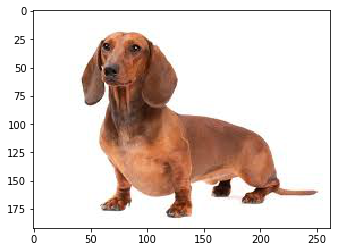

# Predicting Dog-Breeds using Transfer Learning

The goal of this project is to develop an algorithm that could be used as part of a mobile or web app.  The code included here accepts any user-supplied image as input.  If a dog is detected in the image, it will provide an estimate of the dog's breed.  If a human is detected, it will provide an estimate of the dog breed that is most resembling.  

## Currently, the code provided here:
1. Adds a classification layer to ResNet50 trained on ImageNet. 
2. Re-trains the entire network using the weights from ResNet50 as initialization point (i.e. does not freeze the ResNet50 weights)
3. Detects presence of humans by using their faces. Currently, this is done using Haar feature-based cascade classifiers from OpenCV to detect faces (and their location).
4. Detects the presence of dogs by using the labels returned from ResNet50 (i.e. object category is grabbed from ResNet50 before the last 3 Fully-Connected layers)
5. For dog images, the dog-breed is returned (i.e. the output of the full network). 
6. For human images, predicts the dog-breed that is most similar to the given image. 
7. At a future works, the human-dog-breed we'll be calculated using Regenerative networks.

Below is the output of face classifier:
    Number of faces detected: 1
    

Sample output of the fully trained network (trained weights are included in the repo):

    dog detected, the predicted breed is:  Dachshund
    

    
    
    dog detected, the predicted breed is:  Golden_retriever
    

    
    
    human detected, the most similar dog breed is:  Xoloitzcuintli
    

    
    
    dog detected, the predicted breed is:  Doberman_pinscher
    

    
    
    human detected, the most similar dog breed is:  Xoloitzcuintli
    

    
    
    human detected, the most similar dog breed is:  Yorkshire_terrier
    

    
    
    dog detected, the predicted breed is:  Dogue_de_bordeaux
    

    
    
    
